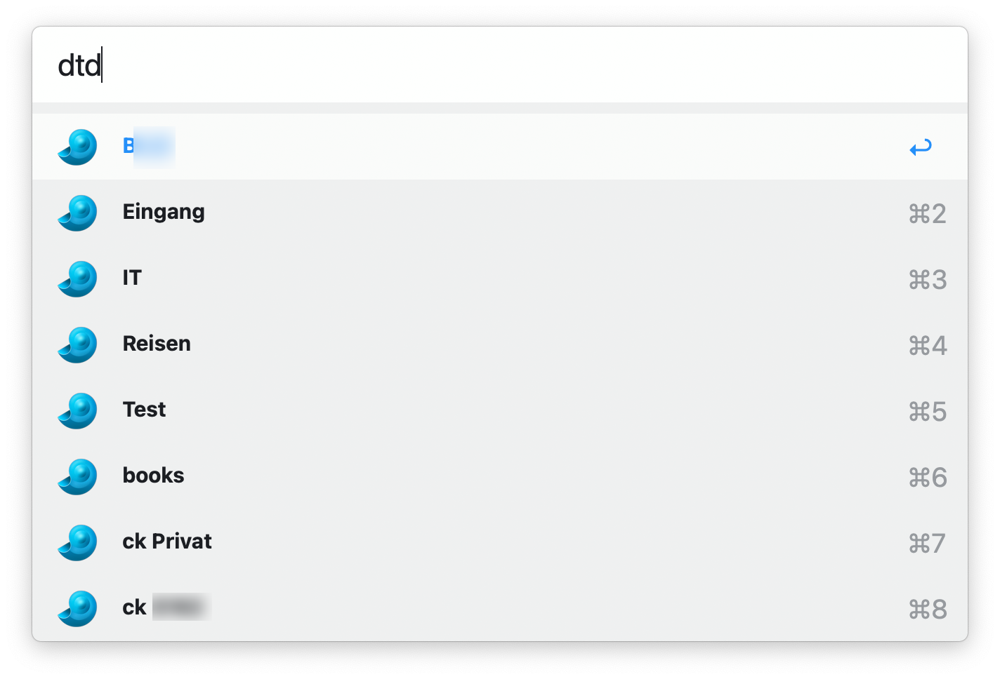
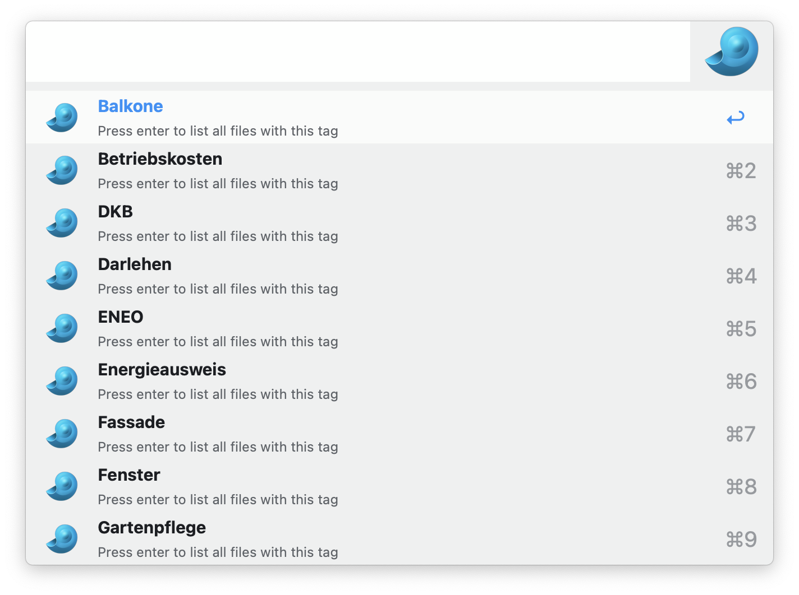
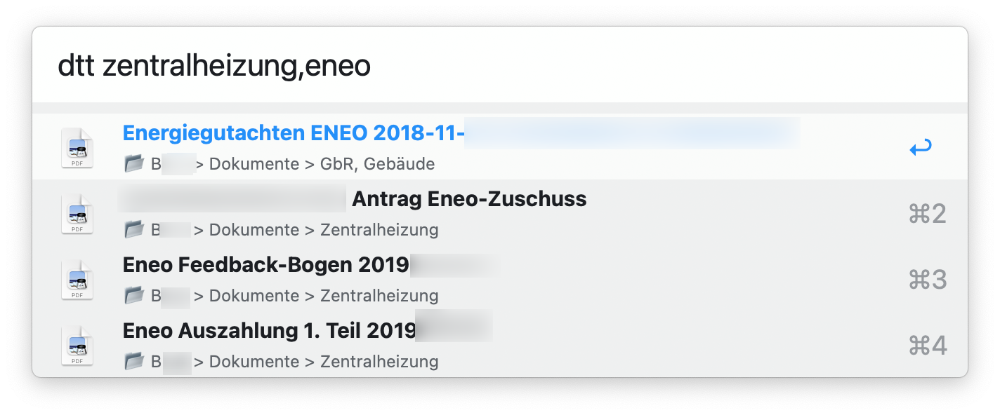
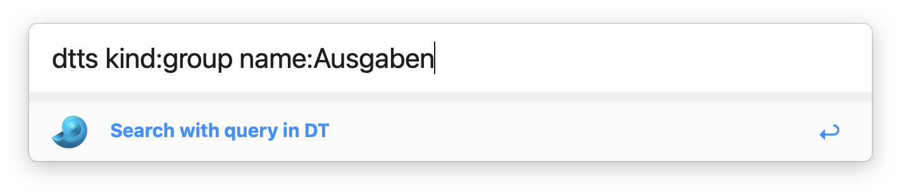

# Alfred Workflow for DEVONthink 3

This workflow re-implements an older one also available on GitHub which depends on Python and other external tools. The new version only uses JavaScript, so that it doesn't depend on certain tools being installed.

It does not yet offer the global variables available in the previous workflow to exclude a group or a list of databases from searches. 

**Note** You must allow Alfred to automate DEVONthink in System Settings/Privacy/Automation. 

## Show all databases

Keyboard shortcut is <kbd>DTD</kbd>. It will populate Alfred's window with the databases currently open (!) in DT. That's different from the result of "show favorites".

With a database selected, 
- <kbd>Enter</kbd> searches in it
- <kbd>Opt-Enter</kbd> shows all its smart groups 
- <kbd>Cmd-Enter</kbd> shows all its tags
- <kbd>Ctrl-Enter</kbd> shows all its groups, excluding Tags and Trash
  - <kbd>Cmd-Enter</kbd> searches in this group

## Opening records

<kbd>Enter</kbd> on any record will open it. If it's a group, it will be opened in DEVONthink, otherwise the standard program will be used. 

<kbd>Opt-Enter</kbd> on any record will reveal it in DEVONthink, i.e. the DEVONthink window will show it highlighted.

<kbd>Cmd-Enter</kbd> on any record will open it in DEVONthink, possibly in a new window. 

<kbd>Ctrl-Enter</kbd> on any record will save a Markdown link to it in the global clipboard. This link is of the form `[name](x-devonthink-item://...)`. 

## Searching in DEVONthink

You can search for tags with <kbd>DTT</kbd>. Separate tags with commas or semicolons. 

You can also use DEVONthink's search syntax. However, the `scope` parameter will not take any effect here. Alternatively, you can search in DEVONthink with <kbd>DTS</kbd>. Again, you can use any valid search string like `kind:group name:receipts`. 

When using <kbd>DTS</kbd>, all databases will be searched. To limit the search to a single database, use <kbd>DTD</kbd>, select the database and start your search with <kbd>Enter</kbd>.

# List Favorites

<kbd>DTF</kbd> lists all favorites. Note that databases can be in the favorites list although they are not currently open. Therefore, this command will implicitly open all databases in the list of favorites. 

## Limit search to group

To limit the search to a certain group, you must
- select a database with <kbd>DTD</kbd>
- get its groups with <kbd>Ctrl-Enter</kbd>)
- select one of the groups and open the search with <kbd>Cmd-Enter</kbd>
## Result order

Results are returned in the following order
- Databases (<kbd>DTD</kbd>) alphabetically by name,
- Groups by location, i.e. first by database, then by name.
- Records (<kbd>DTS</kbd>, <kbd>DTTS</kbd>) first by database, than by ranking,
- Tags (<kbd>DTT</kbd>) alphabetically by name,
- Workspaces (<kbd>DTWL</kbd>) alphabetically by name,
- Smart groups (<kbd>DTSG</kbd>) first by database, than by name,
- Favorites (<kbd>DTF</kbd>) in the order shown in DEVONthink.
## Keyboard shortcuts

All shortcuts can of course be modified.

- <kbd>DTD</kbd> select database for subsequent commands,
  - <kbd>Enter</kbd>: search in this database
  - <kbd>Opt-Enter</kbd>: show all smart groups for this database
  - <kbd>Cmd-Enter</kbd>: show all tags for this database
  - <kbd>Ctrl-Enter</kbd>: show all groups for this database (excluding Tags and Trash)
- <kbd>DTS</kbd>: search in all databases,
  - <kbd>Enter</kbd>: open in default program
  - <kbd>Cmd+Enter</kbd>: open in DEVONthink
  - <kbd>Opt+Enter</kbd>: reveal in DEVONthink
- <kbd>DTSG</kbd> show all smart groups,
- <kbd>DTF</kbd> list favorites. Databases in favorites currently not open will be opened by this command
- <kbd>DTWL</kbd> Load workspace,
- <kbd>DTWS</kbd> Save workspace,
- <kbd>DTTS</kbd>: Search with query in DT,
- <kbd>DTT</kbd> Search for tags. This is a shortcut for <kbd>DTS</kbd> with a query like "tags: t1 tags: t2". Enter the tags separated by commas or semicolons.

